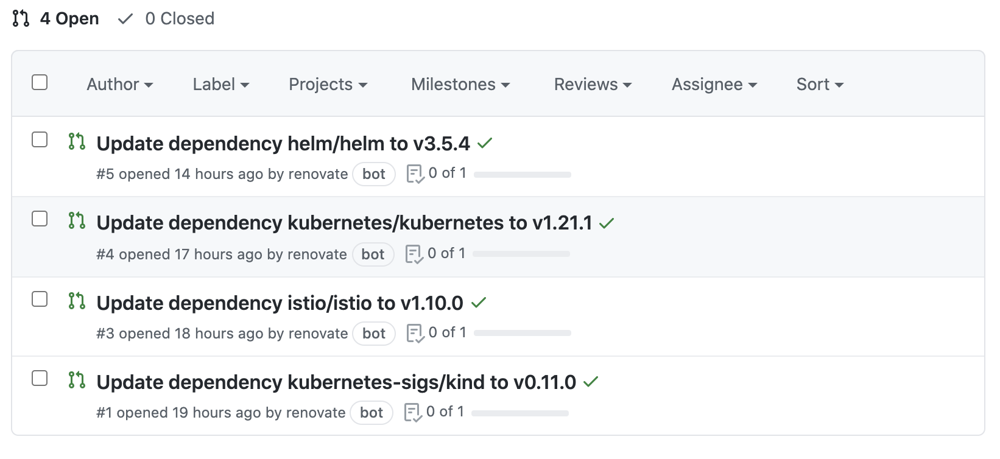

# K8s-tools
This repository was created to automate the installation of some of the k8s-tools by using Ansible & Renovate
Ansible is a great tool for automating installation & and configuration processes and using [Renovate](https://github.com/renovatebot/) to keep versions up-to-date in a git-ops manner is a nice feature to have.

# Installing K8s Tools
We are installing the following tools using binaries for Linux systems:
- kubectl
- istio
- helm
- kind

The installation process shall:
- Do nothing if the current version is the same as the new one
- Force install if required
- Use cached files if possible
- One role per tool

# Renovate
Renovate as it is described in their documentation is an automated dependency updates tool. Multi-platform and multi-language.
It checks for version changes and generates automated Pull Requests whenever dependencies need updating.

For simplicity, we are using [Renovate GitHub App](https://docs.renovatebot.com/install-github-app/), if needed Renovate can be self-hosted.

To [configure Renovate](https://docs.renovatebot.com/configuration-options/), we use the file [renovate.json](./renovate.json). 
```json
{
    "regexManagers": [
      {
        "fileMatch": ["defaults/main.yml"],
        "matchStrings": [
          "# datasource=(?<datasource>.*?) depName=(?<depName>.*?) versioning=(?<versioning>.*?)?\\s[A-Z]+_VERSION: (?<currentValue>.*)?\\s"
        ],
        "matchStringsStrategy": "any"
      }
    ]
  }
```
In our scheme, we use a **regexManagers** to parse and update the ansible roles **defaults/main.yml** files. Let's check each part of the configuration:

- **[fileMatch](https://docs.renovatebot.com/configuration-options/#filematch)**: a file pattern to identify the file to track and parse by renovate.
- **[matchStrings](https://docs.renovatebot.com/configuration-options/#matchstrings)**: regex-like string with defined placeholders to identify configuration items and extract information so renovate can update the Version strings.
- **[matchStringsStrategy](https://docs.renovatebot.com/configuration-options/#matchstringsstrategy)**: controls behavior when multiple matchStrings are provided, in this case, does not affect as we have only one.


## Config Files
For Renovate to identify the currently configured version and to detect the newer versions we need to pass information to it. In our case this is done by adding a comment line just above the version setting as shown below:

```yaml
# datasource=github-tags depName=helm/helm versioning=semver
HELM_VERSION: v3.5.3
```

This two-line string will be matched by the entry we had on the config file on the matchStrings section.

```json
{
        "matchStrings": [
          "# datasource=(?<datasource>.*?) depName=(?<depName>.*?) versioning=(?<versioning>.*?)?\\s[A-Z]+_VERSION: (?<currentValue>.*)?\\s"
        ]
}
```
When this match happens renovate will get the information it needs from the token specified on the regex-like expression on the matchStrings. In our example:
- datasource: github-tags
- depName: helm/helm
- versioning: semver
- currentValue: v3.5.3

With this information, renovate will use the github-tags [datasource](https://docs.renovatebot.com/modules/datasource/) and check the https://github.com/helm/helm repository's tags for new versions, note the depName defines the repository path.
The [versioning](https://docs.renovatebot.com/modules/versioning/) parameter tells Renovate what is the version scheme used so it can extract appropriately what are the new versions in comparison to the current one.

## Results
Below, an example of PRs generated by renovate:


As shown above, Renovate can be a very usefull tool to keep our dependencies or tools versions up to date.

It is important to note that renovate and ansible are both really flexible tools and there may be other alternatives to get the same results, this is only the way i found usefull for the case at hand.